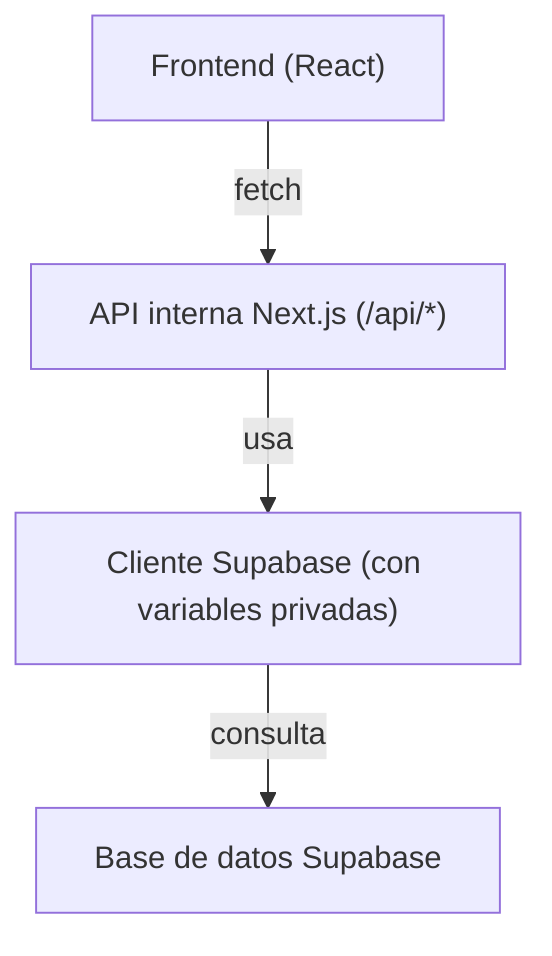

# Tabla de Usuarios

Aplicación web moderna para la gestión de usuarios, construida con Next.js, TypeScript y Supabase.

## 🚀 Características

- Gestión completa de usuarios (CRUD)
- Interfaz moderna y responsiva con Tailwind CSS
- Validación de formularios con Zod
- Estado global con React Query
- Base de datos externa en Supabase
- Docker para desarrollo local
- Despliegue optimizado para Vercel

## 🛠️ Tecnologías

- **Frontend:**
  - Next.js 14
  - TypeScript
  - Tailwind CSS
  - React Query
  - Zod
  - React Hook Form

- **Backend:**
  - Next.js API Routes
  - Supabase (PostgreSQL gestionado)

- **DevOps:**
  - Docker
  - Docker Compose
  - Vercel

## 📋 Prerrequisitos

- Node.js 18 o superior
- Docker y Docker Compose (opcional para desarrollo local)
- Cuenta en [Supabase](https://supabase.com/)
- Cuenta en [Vercel](https://vercel.com/)

## 🔧 Instalación y configuración local

1. Clona el repositorio:
```bash
git clone [URL_DEL_REPOSITORIO]
cd user-table
```

2. Instala dependencias:
```bash
npm install
```

3. Crea un proyecto en [Supabase](https://app.supabase.com/), copia la URL y la clave anónima (anon key).

4. Configura las variables de entorno:
```bash
cp .env.example .env.local
```
Edita `.env.local` con tus datos de Supabase:
```env
SUPABASE_URL=https://xxxx.supabase.co
SUPABASE_KEY=tu-clave-anon
```

5. (Opcional) Inicia con Docker para desarrollo local:
```bash
docker-compose up -d
```

## 🚀 Desarrollo

1. Inicia el servidor de desarrollo:
```bash
npm run dev
```

2. Construye para producción:
```bash
npm run build
```

3. Ejecuta tests:
```bash
npm test
```

## ☁️ Despliegue en Vercel

1. Sube tu repositorio a GitHub, GitLab o Bitbucket.
2. Importa el proyecto en [Vercel](https://vercel.com/).
3. En **Settings → Environment Variables** agrega:
   - `SUPABASE_URL` = (tu URL de Supabase)
   - `SUPABASE_KEY` = (tu clave anónima de Supabase)
4. Haz deploy.

> **Nota:** No necesitas exponer las claves de Supabase al frontend, ya que todas las llamadas a la base de datos se hacen desde las API Routes del backend.

## 🔐 Variables de Entorno

Ejemplo de `.env.local`:
```env
SUPABASE_URL=https://xxxx.supabase.co
SUPABASE_KEY=tu-clave-anon
```

## 📝 API Endpoints

- `GET /api/users` - Obtener todos los usuarios
- `GET /api/users/:id` - Obtener usuario por ID
- `POST /api/users` - Crear nuevo usuario
- `PUT /api/users/:id` - Actualizar usuario
- `DELETE /api/users/:id` - Eliminar usuario
- `GET /api/analytics` - Obtener estadísticas de usuarios

## 📦 Estructura del Proyecto

```
src/
├── app/              # Rutas y páginas de Next.js
├── components/       # Componentes React reutilizables
├── services/         # Servicios y lógica de negocio
├── types/            # Definiciones de TypeScript
├── schemas/          # Esquemas de validación Zod
└── utils/            # Utilidades y helpers
```

## 🐳 Docker (opcional)

### Desarrollo
```bash
docker-compose up -d
```

### Producción
```bash
docker build -t user-table .
docker run -p 3000:3000 user-table
```

## 🔄 Flujo de datos

El frontend nunca accede directamente a Supabase. Todas las operaciones pasan por las API Routes de Next.js, que gestionan la conexión segura con Supabase:



## 🤝 Contribución

1. Haz fork del proyecto
2. Crea una rama para tu feature (`git checkout -b feature/AmazingFeature`)
3. Commit tus cambios (`git commit -m 'Add some AmazingFeature'`)
4. Push a la rama (`git push origin feature/AmazingFeature`)
5. Abre un Pull Request

## 📄 Licencia

Este proyecto está bajo la Licencia MIT - ver el archivo [LICENSE.md](LICENSE.md) para más detalles.

## 👥 Autor

- Tu Nombre - [@tutwitter](https://twitter.com/tutwitter)
