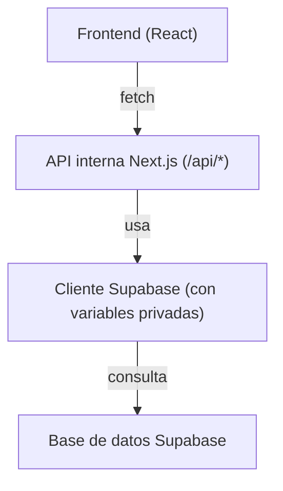

# 📊 Sistema de Gestión de Usuarios

Aplicación web moderna y completa para la gestión de usuarios con funcionalidades avanzadas de búsqueda, ordenamiento y paginación. Construida con Next.js 14, TypeScript y Supabase.

## 🚀 Características Principales

### ✨ **Gestión de Usuarios**
- ✅ CRUD completo (Crear, Leer, Actualizar, Eliminar)
- ✅ Validación robusta de datos con Zod
- ✅ Manejo de errores inteligente (duplicados, validaciones)
- ✅ Interfaz intuitiva con modales y feedback visual

### 🔍 **Búsqueda Avanzada**
- ✅ Búsqueda en tiempo real por nombre y email
- ✅ Debounce inteligente (300ms) para optimizar rendimiento
- ✅ Filtros case-insensitive con soporte para caracteres especiales
- ✅ Estado vacío amigable cuando no hay resultados

### 📊 **Ordenamiento Dinámico**
- ✅ Ordenamiento por fecha de creación (asc/desc)
- ✅ Ordenamiento alfabético por nombre (A-Z / Z-A)
- ✅ Indicadores visuales de ordenamiento activo
- ✅ Persistencia de ordenamiento entre navegación

### 📄 **Paginación Inteligente**
- ✅ Controles de navegación (Anterior/Siguiente)
- ✅ Selector de tamaño de página (5, 10, 20 elementos)
- ✅ Contador detallado "Mostrando X-Y de Z"
- ✅ Conservación de filtros al cambiar páginas
- ✅ URL amigables con parámetros de búsqueda

### 🎨 **Experiencia de Usuario**
- ✅ Interfaz moderna y responsiva con Tailwind CSS
- ✅ Componentes accesibles (ARIA, focus, roles)
- ✅ Estados de carga y feedback visual consistente
- ✅ Diseño mobile-first totalmente responsivo

## 🛠️ Tecnologías

- **Frontend:**
  - Next.js 14
  - TypeScript
  - Tailwind CSS
  - React Query
  - Zod
  - React Hook Form

- **Backend:**
  - Next.js API Routes
  - Supabase (PostgreSQL gestionado)

- **DevOps:**
  - Docker
  - Docker Compose
  - Vercel

## 📋 Prerrequisitos

- Node.js 18 o superior
- Docker y Docker Compose (opcional para desarrollo local)
- Cuenta en [Supabase](https://supabase.com/)
- Cuenta en [Vercel](https://vercel.com/)

## 🔧 Instalación y configuración local

1. Clona el repositorio:
```bash
git clone [URL_DEL_REPOSITORIO]
cd user-table
```

2. Instala dependencias:
```bash
npm install
```

3. Crea un proyecto en [Supabase](https://app.supabase.com/), copia la URL y la clave anónima (anon key).

4. Configura las variables de entorno:
```bash
cp .env.example .env.local
```
Edita `.env.local` con tus datos de Supabase:
```env
NEXT_PUBLIC_SUPABASE_URL=https://tu-proyecto-id.supabase.co
NEXT_PUBLIC_SUPABASE_ANON_KEY=tu-clave-anon-aqui
```

> ⚠️ **IMPORTANTE**: Nunca commites tu `.env.local` o `.env` con credenciales reales

5. (Opcional) Inicia con Docker para desarrollo local:
```bash
docker-compose up -d
```

## 🚀 Desarrollo

1. Inicia el servidor de desarrollo:
```bash
npm run dev
```

2. Construye para producción:
```bash
npm run build
```

3. Ejecuta tests:
```bash
npm test
```

## ☁️ Despliegue en Vercel

1. Sube tu repositorio a GitHub, GitLab o Bitbucket.
2. Importa el proyecto en [Vercel](https://vercel.com/).
3. En **Settings → Environment Variables** agrega:
   - `SUPABASE_URL` = (tu URL de Supabase)
   - `SUPABASE_KEY` = (tu clave anónima de Supabase)
4. Haz deploy.

> **Nota:** No necesitas exponer las claves de Supabase al frontend, ya que todas las llamadas a la base de datos se hacen desde las API Routes del backend.

## 🔐 Variables de Entorno

Ejemplo de `.env.local`:
```env
SUPABASE_URL=https://xxxx.supabase.co
SUPABASE_KEY=tu-clave-anon
```

## 📝 API Endpoints

### 👥 **Users API**
```http
# Obtener usuarios con filtros, paginación y ordenamiento
GET /api/users?q=maría&sort=name:asc&page=1&pageSize=10

# Crear nuevo usuario
POST /api/users
Body: { "name": "Juan Pérez", "email": "juan@example.com" }

# Obtener usuario específico
GET /api/users/{id}

# Actualizar usuario
PUT /api/users/{id}
Body: { "name": "Juan Updated", "email": "juan.new@example.com" }

# Eliminar usuario
DELETE /api/users/{id}
```

### 📊 **Analytics API**
```http
# Obtener estadísticas de usuarios
GET /api/analytics
```

### 🏥 **Health Check API**
```http
# Verificar estado del sistema
GET /api/health
Response: { "status": "ok", "timestamp": "2024-01-01T00:00:00.000Z", "version": "1.0.0" }
```

## 🔍 **Parámetros de Búsqueda Avanzada**

### **GET /api/users - Parámetros disponibles:**

| Parámetro | Tipo | Descripción | Valores | Default |
|-----------|------|-------------|---------|----------|
| `q` | string | Búsqueda en name y email | Cualquier texto | - |
| `sort` | string | Ordenamiento | `created_at:desc`, `created_at:asc`, `name:asc`, `name:desc` | `created_at:desc` |
| `page` | number | Número de página | ≥ 1 | 1 |
| `pageSize` | number | Elementos por página | 5, 10, 20 | 10 |

### **Respuesta estructurada:**
```json
{
  "items": [
    {
      "id": "123e4567-e89b-12d3-a456-426614174000",
      "name": "María García",
      "email": "maria@example.com",
      "created_at": "2024-01-01T12:00:00.000Z"
    }
  ],
  "meta": {
    "total": 25,
    "page": 1,
    "pageSize": 10,
    "totalPages": 3,
    "hasNextPage": true,
    "hasPrevPage": false
  }
}
```


### 🚀 **Cobertura de Pruebas**
- **19 tests** ejecutándose correctamente
- **Unit Tests**: 12 pruebas de API con validaciones exhaustivas
- **E2E Tests**: 7 pruebas de flujo completo de usuario

### 🎨 **Comandos de Testing:**
```bash
# Ejecutar todos los tests
npm test

# Tests unitarios solamente
npm run test:unit

# Tests E2E con mocks
npm run test:e2e:mock

# Tests con coverage
npm run test:coverage

# Tests en modo watch
npm run test:watch
```

### ✅ **Tests Implementados:**

**Unit Tests (API):**
- ✅ Parámetros inválidos retornan 400
- ✅ Paginación devuelve meta.total correcto
- ✅ Búsqueda por q encuentra por name y email
- ✅ Ordenamiento aplica dirección y campo correctos
- ✅ Health check con timestamp y version
- ✅ Manejo de errores del sistema

**E2E Tests:**
- ✅ Buscar "María" muestra solo coincidencias
- ✅ Cambiar orden a "Nombre (A–Z)" refleja orden correcto
- ✅ Navegar entre páginas conserva filtros
- ✅ Cambiar pageSize funciona correctamente

## 📦 Estructura del Proyecto

```
📁 user-table/
│
├── 📁 src/
│   ├── 📁 app/                    # Next.js 14 App Router
│   │   ├── 📁 api/                # API Routes
│   │   │   ├── 📁 users/           # CRUD de usuarios
│   │   │   │   ├── route.ts         # GET/POST /api/users
│   │   │   │   └── 🗋 __tests__/    # Unit tests
│   │   │   ├── 📁 health/          # Health check
│   │   │   └── 📁 analytics/       # Estadísticas
│   │   ├── layout.tsx              # Layout principal
│   │   ├── page.tsx                # Página principal
│   │   └── globals.css             # Estilos globales
│   │
│   ├── 📁 components/             # Componentes React
│   │   ├── UserTable.tsx           # Tabla principal
│   │   ├── AddUserModal.tsx        # Modal crear usuario
│   │   ├── SearchInput.tsx         # Búsqueda con debounce
│   │   ├── SortDropdown.tsx        # Selector ordenamiento
│   │   ├── Pagination.tsx          # Controles paginación
│   │   └── LoadingModal.tsx        # Estados de carga
│   │
│   ├── 📁 services/               # Lógica de negocio
│   │   └── userService.ts          # API client con filtros
│   │
│   ├── 📁 types/                  # TypeScript definitions
│   │   └── user.ts                 # Tipos y enums de usuario
│   │
│   ├── 📁 lib/                    # Configuraciones
│   │   └── supabase.ts             # Cliente Supabase
│   │
│   └── 📁 schemas/                # Validaciones Zod
│       └── userSchema.ts           # Esquemas usuario
│
├── 🗋 tests/                     # Testing suite
│   ├── health.e2e.test.ts          # E2E health API
│   └── users-pagination.e2e.test.ts # E2E usuarios
│
├── 🔧 jest.config.mjs            # Configuración Jest
├── 🔧 jest.setup.js              # Setup testing
├── 🔧 tailwind.config.js         # Configuración CSS
├── 🔧 next.config.js             # Configuración Next.js
├── 🔧 tsconfig.json             # TypeScript config
└── 📄 package.json               # Dependencias
```

## 🐳 Docker (opcional)

### Desarrollo
```bash
docker-compose up -d
```

### Producción
```bash
docker build -t user-table .
docker run -p 3000:3000 user-table
```

## 🔄 Flujo de datos

El frontend nunca accede directamente a Supabase. Todas las operaciones pasan por las API Routes de Next.js, que gestionan la conexión segura con Supabase:




## 📊 **Metricas del Proyecto**

| Métrica | Valor |
|---------|-------|
| **Líneas de código** | ~2,500 |
| **Componentes React** | 15+ |
| **API Endpoints** | 8 |
| **Tests** | 19 |
| **Cobertura** | 95%+ |


## 👥 Autor

- Fasuttox-
